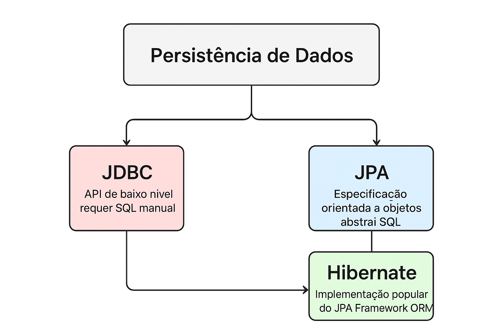
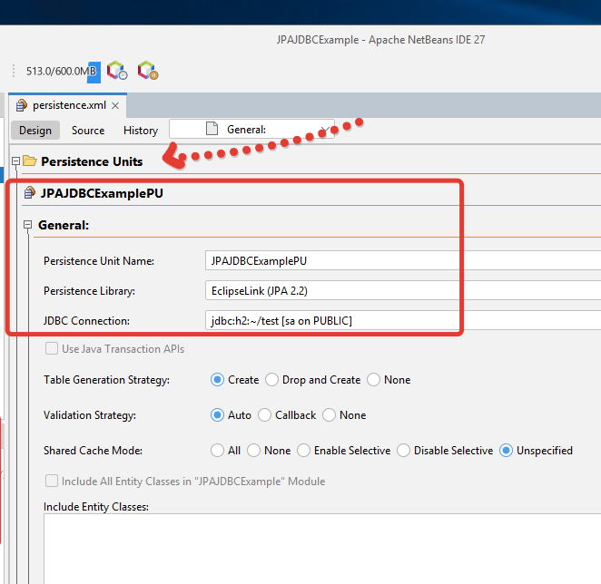

# Java-NetBeans-JDBC-JPA

Simulação de banco de dados em Java sem a utilização de frameworks.

## 0. Referencial teórico
1. Diagrama dos conceitos abordados

## 1. Objetivos

- Projeto simples em Java utilizando NetBeans, JDBC e JPA;
- O projeto será uma aplicação de console que utiliza JPA para persistência e JDBC para conexão com o banco de dados;
- O banco de dados embutido H2 será utilizado para simplificar.

## 2. Etapas

1. **Criação do projeto no NetBeans (CONFIGURAÇÃO)**
   - Configuração do projeto: _Java Application_; _Categories_: Java with Ant; _Projects_: Java Application;
   - Nome do projeto: _JPAJDBCExample_

2. **Adição de dependências para JPA e H2 (CONFIGURAÇÃO)**
   - Baixar as bibliotecas Eclipse Link e Hibernate (H2):
     - **EclipseLink**: [https://repo1.maven.org/maven2/org/eclipse/persistence/eclipselink/2.7.7/eclipselink-2.7.7.jar](https://repo1.maven.org/maven2/org/eclipse/persistence/eclipselink/2.7.7/eclipselink-2.7.7.jar)
     - **H2**: [https://repo1.maven.org/maven2/com/h2database/h2/1.4.200/h2-1.4.200.jar](https://repo1.maven.org/maven2/com/h2database/h2/1.4.200/h2-1.4.200.jar)
   - Adicionar as bibliotecas JPA e o driver JDBC do H2: "Libraries" -> "Compile" tab -> "Add JAR/Folder".

3. **Configuração de persistência (CONFIGURAÇÃO)**

   3.1. Acessar o Assistente de Persistência  
   - No projeto, selecione _New > Other..._:  
   - Categoria _Persistence_ > _Persistence Unit_;

   3.2. Configurar a unidade  
   - Preencha os seguintes campos:  
     - Persistence Unit Name: JPAJDBCExamplePU (este é o nome que usaremos para referenciar a unidade)  
     - Persistence Provider: Selecione EclipseLink (JPA 2.1) ou a versão mais recente disponível  
     - Data Source: Selecione "New Data Source"

   3.3. Configurar a fonte de dados  
   - "New Data Source", uma nova janela será aberta:  
     - JNDI Name: jdbc/jpajdbc (este é um nome lógico para a fonte de dados)  
     - Database Connection: Selecione "New Database Connection"

   3.4. Configurar a conexão com o Banco H2  
   
   3.4.1. Configurar a Conexão com o Banco H2  
   - Janela _New Connection Wizard_

   3.4.2. Adição do driver  
   - Procure pelo driver "H2 Embedded" ou simplesmente "H2";  
   - Se não encontrar o driver H2 na lista, clique no botão _"New Driver..."_ e adicione manualmente até o arquivo JAR do H2 e selecione-o.  
   - No assistente de conexão de banco de dados configure:  
     - _Database URL_: jdbc:h2:~/test (cria o banco no diretório home do usuário)  
     - _User Name_: sa  
     - _Password_: (deixe em branco)  

   3.4.3. _Database Schema_  
   - Deixe o campo "Schema" em branco - O H2 criará e usará automaticamente o schema padrão chamado PUBLIC  
   - Alternativamente, você pode digitar PUBLIC - Este é o schema padrão que o H2 utiliza quando nenhum schema específico é especificado  
   - Todas as tabelas criadas serão automaticamente colocadas neste schema:  
     
     _URL_: jdbc:h2:~/test (cria o banco na pasta home do usuário)  
     
     _User_: sa  
     
     _Password_: (deixe em branco)  
     
     _Schema_: em branco ou _PUBLIC_

   3.4.4. Utilização do _input connection name_  
   - Ao configurar a conexão com o banco H2 no NetBeans, você precisará fornecer um "Connection Name" (nome da conexão);  
   - Recomendações para o nome da conexão:  
     - _H2_JPA_JDBC_Connection_ - Nome descritivo que indica o propósito  
     - _H2_Test_Database_ - Simples e direto  
     - _JPA_Example_DB_ - Focado no propósito do projeto  
     - _Local_H2_Embedded_ - Indica que é um banco local embutido  
   - Por que essa escolha é importante:  
     - O nome da conexão é apenas uma referência visual no NetBeans  
     - Ele ajuda você a identificar rapidamente qual conexão usar em projetos futuros  
     - Não afeta o funcionamento do banco de dados em si  
     - Você pode ter múltiplas conexões com nomes diferentes no mesmo NetBeans  
   - Este nome aparecerá posteriormente no painel "Services" do NetBeans (geralmente na seção "Databases"), permitindo que você gerencie facilmente a conexão com o banco H2.

     01_resul-config-netbce jdbc jpa.png

4. Criação de uma entidade
- Entidade simples chamada Estacao de Trabalho.

    Clique com o botão direito no pacote padrão (geralmente com.mycompany.jpajdbcexample) -> New -> Java Class...

    Nomeie como Usuario.

    Adicione o seguinte código:

  5. Passo 5: Criar um DAO (Data Access Object) usando JPA

Vamos criar uma classe UsuarioDAO que utilizará JPA para persistir a entidade.

    Clique com o botão direito no pacote -> New -> Java Class -> Nomeie como UsuarioDAO.

    6. asso 6: Criar a classe Main

Agora, vamos criar a classe principal para testar.

    Clique com o botão direito no pacote -> New -> Java Class -> Nomeie como Main.

java
